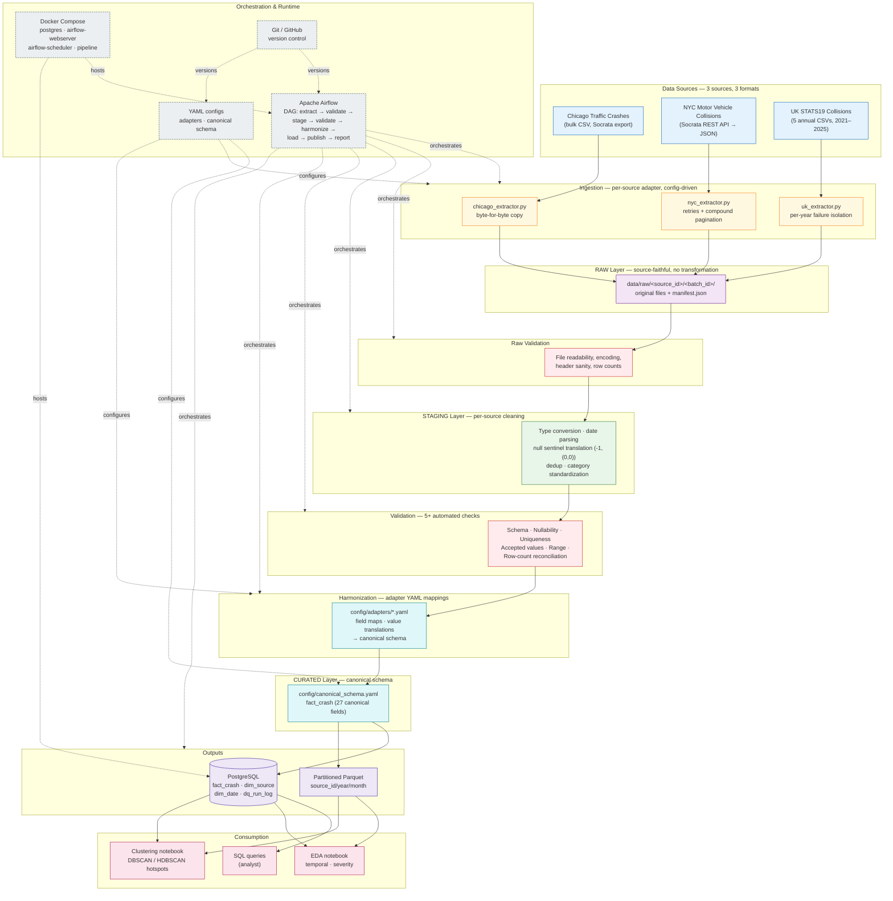
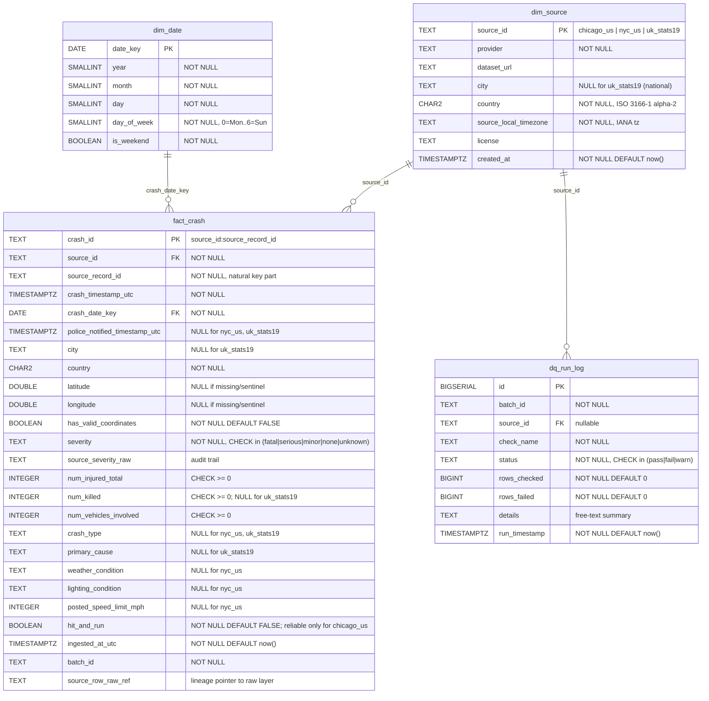

# Diagrams

Architecture, data-flow/lineage, and ERD diagrams for the cross-city road
crash data pipeline. Each diagram is authored as Mermaid source under
`docs/diagrams/` so it diffs cleanly in version control and can be
regenerated or exported to PNG/SVG for the final paper.

Rendered versions appear inline below via VS Code's Markdown Preview
Mermaid Support extension, and on GitHub when this file is viewed there.

---

## 1. Architecture

**Source:** [`diagrams/architecture.mmd`](diagrams/architecture.mmd)

Covers: sources → ingestion → raw → validation → staging → harmonization →
curated → Postgres + Parquet → consumption, with Airflow as the
orchestration layer, Docker Compose as the runtime, YAML as config, and
Git as version control.

**Reading this diagram:** Solid arrows are data flow; dashed arrows are
orchestration/runtime relationships (Airflow *schedules* the stages, it
is not itself a data stage). The two validation bands are distinct: the
first checks raw-file integrity (is this actually a readable CSV?), the
second enforces the 5+ data-quality rules from proposal section 8. The
curated layer has two output targets — Postgres for SQL access and
Parquet for columnar analytical reads — both fed from the same canonical
schema.

---

## 2. Data Flow / Lineage

**Source:** [`diagrams/lineage.mmd`](diagrams/lineage.mmd)

Traces each canonical `fact_crash` field back to its source column(s)
across `chicago_us`, `nyc_us`, and `uk_stats19`, including the
`source_row_raw_ref` → raw-layer file → `batch_id` → `manifest.json`
traceability chain. Structural nulls (fields a source cannot populate)
are shown as dashed paths, matching the gap matrix in
`docs/data_dictionary.md`.

```mermaid
flowchart LR
    subgraph CHI["chicago_us — bulk CSV"]
        direction TB
        CH1["CRASH_RECORD_ID"]
        CH2["CRASH_DATE"]
        CH3["DATE_POLICE_NOTIFIED"]
        CH4["LATITUDE / LONGITUDE"]
        CH5["MOST_SEVERE_INJURY"]
        CH6["INJURIES_TOTAL"]
        CH7["INJURIES_FATAL"]
        CH8["NUM_UNITS"]
        CH9["FIRST_CRASH_TYPE"]
        CH10["PRIM_CONTRIBUTORY_CAUSE"]
        CH11["WEATHER_CONDITION"]
        CH12["LIGHTING_CONDITION"]
        CH13["POSTED_SPEED_LIMIT"]
        CH14["HIT_AND_RUN_I"]
    end

    subgraph NYC["nyc_us — Socrata API (JSON)"]
        direction TB
        NY1["collision_id"]
        NY2["crash_date + crash_time"]
        NY3["latitude / longitude"]
        NY4["number_of_persons_injured"]
        NY5["number_of_pedestrians_killed<br/>+ number_of_cyclist_killed<br/>+ number_of_motorist_killed"]
        NY6["vehicle_type_code1..5<br/>(non-null count)"]
        NY7["contributing_factor_vehicle_1"]
        NY8["— no severity field —"]
        NY9["— no crash_type field —"]
        NY10["— no weather field —"]
        NY11["— no lighting field —"]
        NY12["— no speed_limit field —"]
        NY13["— no hit_and_run field —"]
    end

    subgraph UK["uk_stats19 — 5 annual CSVs"]
        direction TB
        UK1["collision_index"]
        UK2["date + time<br/>(DD/MM/YYYY)"]
        UK3["latitude / longitude"]
        UK4["collision_severity<br/>(1=fatal, 2=serious, 3=minor)"]
        UK5["number_of_casualties"]
        UK6["number_of_vehicles"]
        UK7["weather_conditions<br/>(-1 → null)"]
        UK8["light_conditions<br/>(-1 → null)"]
        UK9["speed_limit<br/>(-1 → null)"]
        UK10["— no police_notified field —"]
        UK11["— no num_killed field —"]
        UK12["— no crash_type field —"]
        UK13["— no primary_cause field —"]
        UK14["— no hit_and_run field —"]
    end

    subgraph CANON["fact_crash — canonical curated table"]
        direction TB
        F1["crash_id<br/>{source_id}:{source_record_id}"]
        F2["source_record_id"]
        F3["crash_timestamp_utc"]
        F4["police_notified_timestamp_utc"]
        F5["latitude / longitude<br/>+ has_valid_coordinates"]
        F6["severity"]
        F7["source_severity_raw"]
        F8["num_injured_total"]
        F9["num_killed"]
        F10["num_vehicles_involved"]
        F11["crash_type"]
        F12["primary_cause"]
        F13["weather_condition"]
        F14["lighting_condition"]
        F15["posted_speed_limit_mph"]
        F16["hit_and_run"]
        F17["city / country"]
    end

    subgraph LINEAGE["Row-level traceability"]
        direction TB
        L1["fact_crash.source_row_raw_ref"]
        L2["data/raw/{source_id}/{batch_id}/<br/>original file at row N"]
        L3["manifest.json<br/>retrieved_at_utc · sha256 · record_count"]
    end

    %% Chicago → canonical
    CH1 --> F2
    CH1 --> F1
    CH2 --> F3
    CH3 --> F4
    CH4 --> F5
    CH5 --> F6
    CH5 --> F7
    CH6 --> F8
    CH7 --> F9
    CH8 --> F10
    CH9 --> F11
    CH10 --> F12
    CH11 --> F13
    CH12 --> F14
    CH13 --> F15
    CH14 --> F16

    %% NYC → canonical
    NY1 --> F2
    NY1 --> F1
    NY2 --> F3
    NY3 --> F5
    NY4 --> F8
    NY5 --> F9
    NY6 --> F10
    NY7 --> F12

    %% UK → canonical
    UK1 --> F2
    UK1 --> F1
    UK2 --> F3
    UK3 --> F5
    UK4 --> F6
    UK4 --> F7
    UK5 --> F8
    UK6 --> F10
    UK7 --> F13
    UK8 --> F14
    UK9 --> F15

    %% Structural gaps (dashed = not populated by this source)
    NY8 -.->|"cannot populate"| F6
    NY9 -.->|"cannot populate"| F11
    NY10 -.->|"cannot populate"| F13
    NY11 -.->|"cannot populate"| F14
    NY12 -.->|"cannot populate"| F15
    NY13 -.->|"cannot populate"| F16
    UK10 -.->|"cannot populate"| F4
    UK11 -.->|"cannot populate"| F9
    UK12 -.->|"cannot populate"| F11
    UK13 -.->|"cannot populate"| F12
    UK14 -.->|"cannot populate"| F16

    %% Row-level lineage chain
    F1 -.->|"via batch_id"| L1
    L1 --> L2
    L2 --> L3

    classDef chiStyle   fill:#e3f2fd,stroke:#1565c0,stroke-width:1px
    classDef nycStyle   fill:#fff8e1,stroke:#f57f17,stroke-width:1px
    classDef ukStyle    fill:#e8f5e9,stroke:#2e7d32,stroke-width:1px
    classDef canonStyle fill:#e0f7fa,stroke:#00838f,stroke-width:2px
    classDef linStyle   fill:#f3e5f5,stroke:#6a1b9a,stroke-width:1px
    classDef gapStyle   fill:#ffebee,stroke:#c62828,stroke-width:1px,stroke-dasharray: 3 2

    class CH1,CH2,CH3,CH4,CH5,CH6,CH7,CH8,CH9,CH10,CH11,CH12,CH13,CH14 chiStyle
    class NY1,NY2,NY3,NY4,NY5,NY6,NY7 nycStyle
    class NY8,NY9,NY10,NY11,NY12,NY13,UK10,UK11,UK12,UK13,UK14 gapStyle
    class UK1,UK2,UK3,UK4,UK5,UK6,UK7,UK8,UK9 ukStyle
    class F1,F2,F3,F4,F5,F6,F7,F8,F9,F10,F11,F12,F13,F14,F15,F16,F17 canonStyle
    class L1,L2,L3 linStyle
```

**Reading this diagram:** Solid arrows are real field mappings from an
adapter YAML. Dashed red arrows labelled "cannot populate" are the
structural gaps from `docs/data_dictionary.md` — fields a source does not
collect, not mapping omissions. Blue = Chicago, amber = NYC, green = UK,
cyan = canonical `fact_crash`. The purple band at the bottom is the
row-level lineage chain: every `fact_crash` row carries a
`source_row_raw_ref` pointing back to the exact file in
`data/raw/{source_id}/{batch_id}/`, whose `manifest.json` records when it
was retrieved and its SHA-256.

---

## 3. Entity-Relationship Diagram (ERD)

**Source:** [`diagrams/erd.mmd`](diagrams/erd.mmd)

Derived from `sql/schema.sql`. Covers `dim_source`, `dim_date`,
`fact_crash`, and `dq_run_log`, with foreign keys, the
`uq_fact_crash_source_natural_key` UNIQUE constraint, and CHECK
constraints shown as annotations.

